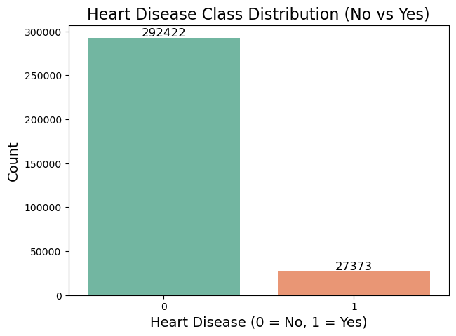
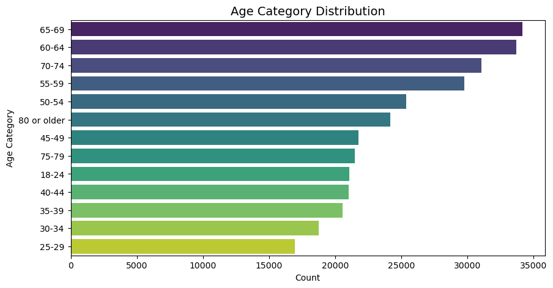
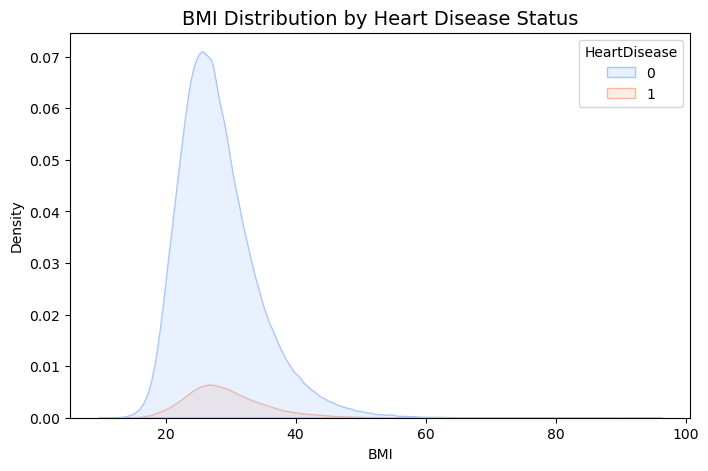
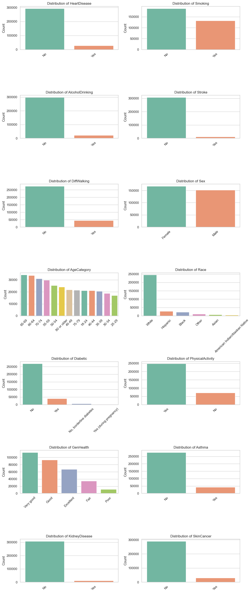
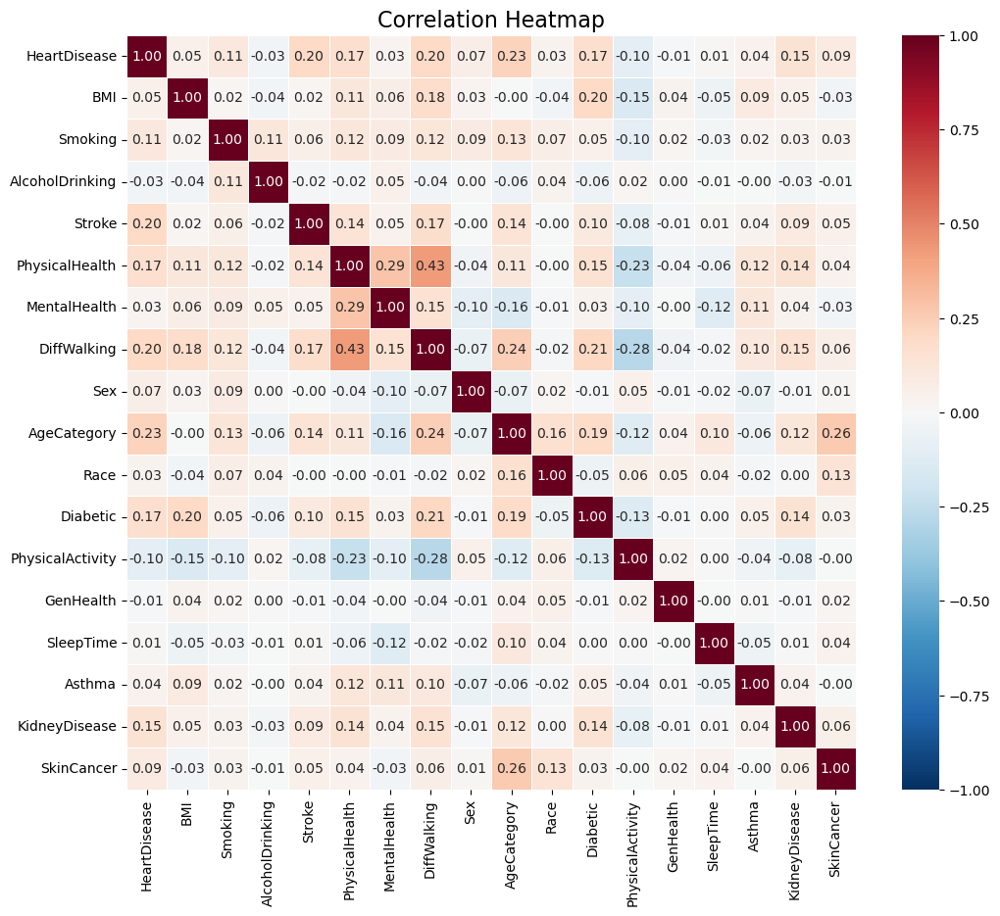
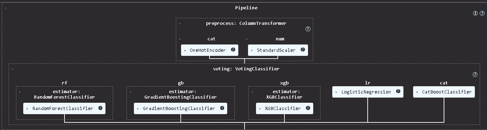
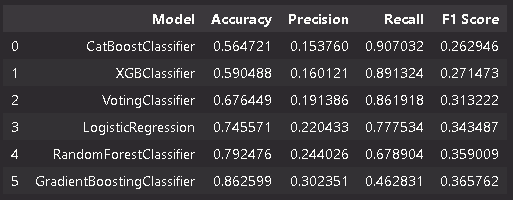
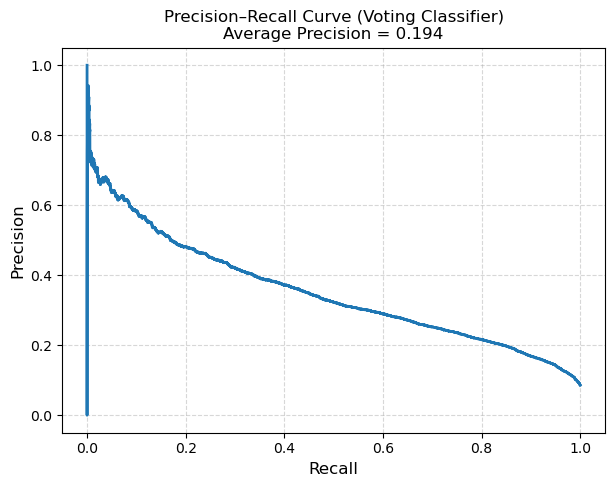

# 🫀 Love Your Heart - Heart Disease Risk Prediction Using Machine Learning

A comprehensive end-to-end health analytics & ML project focused on predicting a person's heart attack riskusing clinical, lifestyle, and demographic def-reprot data.

## 📌 Table of Contents
- [🫀 Love Your Heart - Heart Disease Risk Prediction Using Machine Learning](#-love-your-heart---heart-disease-risk-prediction-using-machine-learning)
  - [📌 Table of Contents](#-table-of-contents)
  - [🧩 Project Overview](#-project-overview)
  - [❗ Problem Statement](#-problem-statement)
  - [📊 Dataset Description](#-dataset-description)
  - [🔍 Exploratory Data Analysis (EDA)](#-exploratory-data-analysis-eda)
    - [1️⃣ Class Imbalance](#1️⃣-class-imbalance)
    - [2️⃣ Numerical Feature Distributions](#2️⃣-numerical-feature-distributions)
    - [3️⃣ Categorical Feature Distributions](#3️⃣-categorical-feature-distributions)
    - [4️⃣ 📌 Correlation Heatmap](#4️⃣--correlation-heatmap)
  - [🧼 Data Preprocessing](#-data-preprocessing)
  - [🤖 Modeling Approach](#-modeling-approach)
    - [🎯 Hyperparameter Tuning](#-hyperparameter-tuning)
      - [1. Grid Search \& Randomized Search](#1-grid-search--randomized-search)
        - [2. Class Weights](#2-class-weights)
      - [3. scale\_pos\_weight in XGBoost](#3-scale_pos_weight-in-xgboost)
      - [4. Iteration \& Depth Tuning for CatBoost](#4-iteration--depth-tuning-for-catboost)
      - [5. Propability Calibration](#5-propability-calibration)
    - [✅ Overall Tuning Outcome](#-overall-tuning-outcome)
    - [📈 Model Comparison](#-model-comparison)
    - [🎯 Threshold Optimization](#-threshold-optimization)
  - [🧠 Explainability Using SHAP](#-explainability-using-shap)
    - [Why SHAP?](#why-shap)
    - [Why KernelExplainer?](#why-kernelexplainer)
    - [How SHAP is used in this project](#how-shap-is-used-in-this-project)
    - [What users see](#what-users-see)
  - [🤖 CHATBOT Module:](#-chatbot-module)
    - [Core Components](#core-components)
  - [📈 Workflow Diagrams:](#-workflow-diagrams)
      - [1️⃣ System Architecture Diagram](#1️⃣-system-architecture-diagram)
      - [2️⃣ Chatbot Workflow Diagram](#2️⃣-chatbot-workflow-diagram)
  - [🚀 Deployment](#-deployment)
  - [⚠️ Limitations](#️-limitations)
  - [🔮 Future Work](#-future-work)
  - [🏁 Conclusion](#-conclusion)

## 🧩 Project Overview

We build a machine learning model that predicts the likelihood of heart disease based on a users lifestyle, medical history, and health metrics.
The model is deployed as an interactive Streamlit-app allow users to assess their risk score.
This documentation summarizes the entire workflow, decisions taken, trade-offs, and final model deployment strategy.

## ❗ Problem Statement

Heart disease, including heart attacks, remains one of the world’s leading causes of death. Early detection can significantly improve survival rates. The goal of this project is to:
* Build a predictive model that produces a probability score of belonging to the heart attack class (0–100%)
* Minimize false negatives (missed high-risk cases)
* Provide users with explainable and actionable insights

## 📊 Dataset Description

**Dataset used:** BRFSS_2020_Heart_Disease_Dataset - https://zenodo.org/records/15364962
Contains 320,000+ rows and 18 features across:

**Demographic factors:** sex, age category (14 levels), race, BMI (Body Mass Index)

**Diseases:** weather respondent ever had such diseases as **asthma, skin cancer, diabetes, stroke or kidney disease** (not including kidney stones, bladder infection or incontinence)

**Unhealthy habits:**
* **Smoking** - respondents that smoked at least 100 cigarettes in their entire life (5 packs = 100 cigarettes)
* **Alcohol Drinking** - heavy drinkers (adult men having more than 14 drinks per week and adult women having more than 7 drinks per week).
  
**General Health:**
* **Difficulty Walking** - weather respondent have serious difficulty walking or climbing stairs
* **Physical Activity** - adults who reported doing physical activity or exercise during the past 30 days other than their regular job
* **Sleep Time** - respondent’s reported average hours of sleep in a 24-hour period
* **Physical Health** - number of days being physically ill or injured (0-30 days)
* **Mental Health** - number of days having bad mental health (0-30 days)
* **General Health** - respondents declared their health as ’Excellent’, ’Very good’, ’Good’ ,’Fair’ or ’Poor’

## 🔍 Exploratory Data Analysis (EDA)
The dataset consists of both categorical and numerical features representing demographic, lifestyle, and health-related attributes. 

### 1️⃣ Class Imbalance

Heart disease is heavily imbalanced (only ~8% "Yes").



Only 8% of the dataset represents heart-attack cases, creating a strong class imbalance. To handle this, techniques like SMOTE (Synthetic Minority Over-sampling Technique), class-weighted models, and threshold tuning were applied to improve detection of high-risk individuals while maintaining overall accuracy. Properly addressing this imbalance is crucial to avoid missing critical high-risk cases.

### 2️⃣ Numerical Feature Distributions
Numerical features, including BMI, Age, and PhysicalHealth, display distinct distributions that help identify risk patterns. 





### 3️⃣ Categorical Feature Distributions
Categorical features such as Sex, Smoking, AlcoholDrinking, and Diabetic exhibit varying proportions across different classes, highlighting trends like higher smoking prevalence among certain groups. 



### 4️⃣ 📌 Correlation Heatmap



The heatmap helps identify which features are most strongly related to heart disease risk. Features like age, sex, smoking, alcohol comsumption, are positively correlated with risk, while lifestyle-related features such as physical activity and adequate sleep are negatively correlated. These insights can guide feature selection
and interpretation in predictive modeling.

## 🧼 Data Preprocessing

1. Train-test split (80–20, stratified)
2. Preprocessor
   1. Handling categorical variables via OneHotEncoder
   2. Scaling numerical values
3. SMOTE (optional depending on model)
4. Voting classifier



## 🤖 Modeling Approach

We used 5 major models:

| Model               | Notes                                                   |
| ------------------- | ------------------------------------------------------- |
| Logistic Regression | Baseline, interpretable                                 |
| Random Forest       | Good recall, handles non-linearities                    |
| Gradient Boosting   | Stable performance, robust to overfitting               |
| XGBoost             | Strong tree-based model, fast and scalable              |
| CatBoost            | Excellent with categorical data, handles missing values |

### 🎯 Hyperparameter Tuning

To improve model performance and ensure robust generalization, several hyperparameter optimization techniques were applied. The tuning process focused on improving recall for the minority class while maintaining acceptable precision.

#### 1. Grid Search & Randomized Search
Both *GridSearchCV* and *RandomizedSearchCV* were used depending on the model complexity:
*Grid Search* was applied to simpler models like Logistic Regression and Random Forest, where the parameter space was small.
*Randomized Search* was used for Gradient Boosting and XGBoost due to their larger parameter space, allowing faster exploration of combinations.

These search strategies helped identify optimal parameter ranges such as learning rate, tree depth, and number of estimators.

##### 2. Class Weights
Because the dataset is highly imbalanced (only ~8% positive cases), class weights were introduced to make the models more sensitive to minority-class predictions:
Models like Logistic Regression, Random Forest, and GradientBoosting were trained with class_weight='balanced'.

This ensures higher penalties for misclassifying positive (risk) cases, improving recall.

#### 3. scale_pos_weight in XGBoost
For XGBoost, the imbalance was handled using scale_pos_weight, computed as:
```
scale_pos_weight = number of negative samples / number of positive samples
```

This parameter tells XGBoost to give more importance to the minority class, improving risk detection without excessively increasing false positives.

#### 4. Iteration & Depth Tuning for CatBoost
CatBoost, which handles categorical data efficiently, was tuned for:
* **iterations** (number of trees) – higher iterations improved performance but were controlled to avoid overfitting.
* **depth** – deeper trees improved recall but increased variance, so an optimal mid-range depth was selected.
  
Additional parameters like learning rate and class weights were adjusted to maximize recall on the minority class.

#### 5. Propability Calibration
Tree-based models (RF/GB/XGB) tend to output uncalibrated, overconfident probabilities, so we applied: *CalibratedClassifierCV*

Two calibration methods were used:

- Isotonic Regression (more flexible, better for medium-large datasets)
- Sigmoid (Platt Scaling) (more stable for smaller datasets)

Purpose of Calibration

- Ensures a model score of 0.70 truly reflects ~70% risk
- Improves fairness across categories
- Makes thresholding (0.2, 0.35, 0.5) more reliable
- Builds user trust in the risk score displayed in the app

### ✅ Overall Tuning Outcome

By combining these techniques, each model was optimized to strike a balance between:
* High recall (detect as many true high-risk cases as possible),
* Controlled false positives, and
* Stable generalization performance.
  
This tuning strategy ultimately enabled the Voting Classifier to outperform individual models in terms of balanced performance.

### 📈 Model Comparison



After evaluating all models across multiple performance metrics, we observed that XGBoost and CatBoost achieved the highest recall scores, making them strong candidates for identifying high-risk individuals. However, both models also produced a larger number of false positives, which can reduce the overall precision of the system.

To balance this trade-off, we incorporated multiple strong learners into a Voting Classifier, combining the strengths of Logistic Regression, Random Forest, XGBoost, and CatBoost. The ensemble model demonstrated more stable performance, achieving a significantly better balance between recall and false-positive control.

Because of this improved overall reliability and its ability to maintain high recall while reducing false alarms, the Voting Classifier was selected as the final model for deployment.

### 🎯 Threshold Optimization



In highly imbalanced classification tasks such as heart-disease risk prediction, relying on the default probability threshold of 0.50 often results in a large number of false negatives — cases where high-risk individuals are incorrectly predicted as low-risk. Since missing a positive (high-risk) case has much higher clinical impact, threshold optimization becomes essential.

To address this, we evaluated the model using the Precision–Recall (PR) Curve, which is more informative than ROC-AUC for imbalanced datasets. The Voting Classifier achieved an Average Precision (AP) of 0.194, indicating moderate ability to distinguish minority-class samples across varying thresholds.

The model predicts the **probability of a user belonging to the heart attack class**. Rather than using the standard 0.50 cutoff, we define **risk bands based on a custom-calibrated threshold**, allowing the probability to be translated into actionable risk categories.

By analyzing the Precision-Recall curve, we found that lowering the threshold significantly improved recall without causing an unmanageable drop in precision. The optimal balance was achieved at a threshold of **0.19**, where:

- **Recall increased substantially**, capturing far more true high-risk cases  
- **Precision remained acceptable**, keeping false positives at a manageable level  
- **False negatives were minimized**, which is critical for a health-risk prediction system  

This threshold strategy ensures the model is **more sensitive to the minority (positive) class**, aligning with the project’s objective of early identification of high-risk individuals. Using the probability output in combination with this threshold, we provide users with **risk bands** rather than a simple binary prediction, giving a more nuanced and interpretable measure of heart-attack risk.

At this threshold:  
* Higher recall  
* Acceptable precision  
* Balanced trade-off between false negatives and false positives


## 🧠 Explainability Using SHAP
We use [SHAP](https://shap.readthedocs.io/) (SHapley Additive exPlanations) to make our model’s predictions transparent and understandable. SHAP shows how each input feature increases or decreases the predicted probability that a user’s profile resembles those of individuals in the dataset who reported a past heart attack.


### Why SHAP?
* Explains why the model predicts a certain probability
* Identifies the most influential features (“risk drivers”)
* Highlights which factors are modifiable
* Supports What-If analysis (how prediction changes if a user changes an input)

### Why KernelExplainer?
Our final model is a VotingClassifier combining tree-based and linear models.
TreeExplainer cannot explain this ensemble, so we use the [*KernelExplainer*](https://shap.readthedocs.io/en/latest/generated/shap.KernelExplainer.html), which is 

➕ Model-agnostic  
➖ Slower, only returns approximated importances and depends heavily on chosen background data 

### How SHAP is used in this project
1. **Preprocessing:**   SHAP is applied after full preprocessing (encoding, scaling, imputation) to ensure consistent explanations.
2. **Prediction wrapper:** SHAP uses a wrapper around the VotingClassifier’s predict_proba() to extract the positive-class probability.
3. **Background data:** A small subset of the training data (here: first 50 rows, as the prediction becomed slow with more records )is used as SHAP background for stability.
4. **Feature aggregation:** SHAP values from encoded features are merged back into the original feature names.
5. **Modifiable factors:** Features are labeled as modifiable or non-modifiable for clearer risk communication.
6. **What-If analysis:** When a user changes an input, SHAP computes a second explanation and displays differences as blue dots.

### What users see
* Bars → feature influence (positive/negative)
* Colors → modifiability of the factor
* Labels → user’s actual input
* Optional blue dots → What-If scenario differences

This ensures transparent, actionable, and user-friendly interpretations.

## 🤖 CHATBOT Module:
Our application includes an AI-powered chatbot that helps users interpret their heart-risk results and receive tailored lifestyle guidance. It is built using a **Retrieval-Augmented Generation (RAG)** pipeline, ensuring responses remain factual, context-aware, and grounded in trusted cardiovascular-health sources.

### Core Components
**LLM**  
We use **Groq’s `llama-3.3-70b-versatile`**, chosen for its fast inference, strong reasoning ability, and robust multilingual support.

**Embedding Model**  
The chatbot relies on **`sentence-transformers/distiluse-base-multilingual-cased-v1`**, which supports **German and English** and provides efficient, high-quality semantic embeddings. These are stored locally for speed and reproducibility.

**Knowledge Base**  
The chatbot’s responses are grounded in a curated evidence base drawn from cardiovascular prevention guidelines, German population-health summaries, practical lifestyle recommendations, and a recent meta-analysis.

**Personalization & Context**  
User-provided information—such as BMI, activity, smoking, and general health—is added to the system prompt for personalized explanations. A controlled **chat memory buffer** maintains short-term context without storing unnecessary sensitive data.

**Safety & Behavior**  
The chatbot is configured to:
- give short, clear responses,  
- avoid diagnoses or medication advice,  
- focus on modifiable lifestyle factors,  
- recommend consulting a clinician when appropriate,  
- remind users that this tool does not replace medical care.

**Purpose**  
By combining modern LLM reasoning, multilingual embeddings, and high-quality health documents, the chatbot provides clear, personalized, and reliable support throughout the heart-risk assessment workflow.

## 📈 Workflow Diagrams:

#### 1️⃣ System Architecture Diagram
```
+-----------------+
|   User Interface| <-- Streamlit (TestYourself / AI Assistant pages)
+-----------------+
          |
          v
+--------------------------+
|  Preprocessing Pipeline  | <-- StandardScaler, OneHotEncoder, Feature Engineering
+--------------------------+
          |
          v
+--------------------------+
|   Voting Classifier      | <-- RandomForest, GradientBoosting, XGBoost, LogisticRegression
+--------------------------+
          |
          v
+--------------------------+
|   Risk Prediction & Score| <-- Probability, Risk Categories, Threshold Optimization
+--------------------------+
          |
          v
+--------------------------+
|       AI Chatbot         | <-- LLM + RAG Memory + API Integration
+--------------------------+
          |
          v
+--------------------------+
| Personalized Recommendations | <-- Risk Explanation, Lifestyle Advice
+--------------------------+
```

#### 2️⃣ Chatbot Workflow Diagram
```
User Input (Question / Profile Data)
          |
          v
+--------------------+
|  Session State     | <-- Stores user profile, prior interactions
+--------------------+
          |
          v
+--------------------+
| Prefix Messages    | <-- System role + user profile + instructions
+--------------------+
          |
          v
+--------------------+
|   RAG Engine       | <-- Retrieves relevant context from Vector DB
+--------------------+
          |
          v
+--------------------+
|   LLM (Grok API)   | <-- Generates concise and context-aware response
+--------------------+
          |
          v
+--------------------+
|  Response Rendering| <-- Displayed on Streamlit Chat Interface
+--------------------+
```


## 🚀 Deployment
The final heart-risk prediction system is deployed as an interactive web application built with Streamlit, enabling accessible, real-time use directly in the browser. The deployment integrates all core model components into a seamless inference pipeline: data preprocessing, calibrated probability estimation, and threshold-based risk band assignment (using the optimized 0.19 cutoff). This ensures that end users receive both a clear probability of belonging to the “heart attack” class and an interpretable risk category.

The streamlined Streamlit UI presents results visually, incorporates profile-aware recommendations, and connects to the RAG-powered chatbot. The entire application is deployed via GitHub and publicly accessible at https://loveyourheart.streamlit.app/

## ⚠️ Limitations
* **Data Source and Representativeness:** The model is trained on BRFSS 2020 survey data from the U.S., which is self-reported and subject to recall bias. Its applicability to the German population is limited and should be interpreted cautiously.

* **Cross-Sectional and Binary Target:** The model predicts a binary heart-attack target and converts it to a risk percentage. BRFSS provides only a snapshot in time, so predictions reflect associations, not causation.

* **False Positives and Risk Interpretation:** Despite careful threshold tuning to minimize false negatives and catch as many true high-risk users as possible, the model still produces a substantial number of false positives. Consequently, the risk percentages may overestimate actual risk for some users, and users flagged as higher risk should interpret the predictions as indicative rather than definitive.

* **Feature and Clinical Limitations:** Only self-reported demographic and lifestyle features are included. Important clinical data (e.g., lab results, medications) are missing, which may limit accuracy.

* **Interpretability and External Validation:** SHAP values provide some insight, but ensemble model interactions remain complex. The model has not been externally validated in German datasets, so performance may differ in practice.

## 🔮 Future Work
- **Add clinical features**: Incorporate lab results (cholesterol, blood pressure), medications, or genetic risk factors to improve predictive accuracy.  

- **Time-series health monitoring**: Capture longitudinal data for trends in weight, activity, blood pressure, or other vitals to better estimate evolving risk.  

- **Include ECG/medical imaging features**: Integrate structured clinical data or imaging-derived biomarkers for more precise cardiovascular risk assessment.  

- **Build API and mobile app**: Facilitate real-time user interaction, data collection, and integration with wearable devices for more personalized recommendations.  

- **Continuous model monitoring and retraining**: Track model performance over time, particularly false positive and negative rates, and update with new data to maintain reliability.  

- **Multi-modal risk estimation**: Combine self-reported data with device or sensor data (smartwatch, step counts) to reduce uncertainty in risk percentages.  

- **Localization and population calibration**: Adjust model outputs to reflect the German population, considering differences from the US-based BRFSS dataset.

## 🏁 Conclusion
This project demonstrates the development of a personalized heart-risk assessment tool based on machine learning and user-reported lifestyle data.  

- Achieved a strong balance of high recall and reasonable precision, prioritizing detection of at-risk users.  
- Developed a fully interpretable and deployable model that can be integrated into healthcare assistance tools.  
- Improved heart risk detection leveraging advanced machine learning techniques and robust preprocessing.  
- Applied SHAP values to provide transparent explanations of individual risk drivers, enabling user understanding and actionable insights.  

The final model is suitable for interactive applications, supporting personalized lifestyle guidance and risk assessment, while remaining transparent and user-focused.  

Looking forward, the app can be extended with richer clinical features, continuous monitoring, and integration into mobile-based health platforms to further enhance user support.
